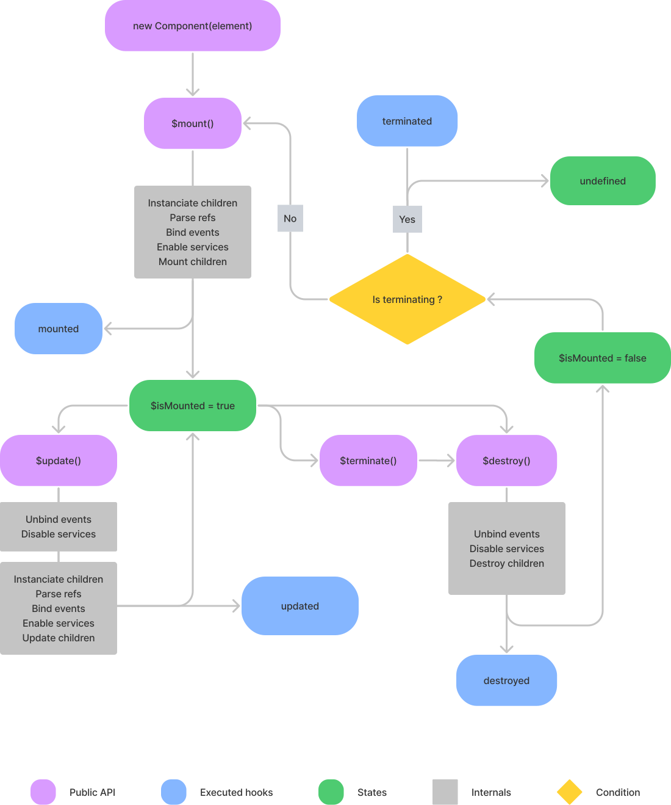
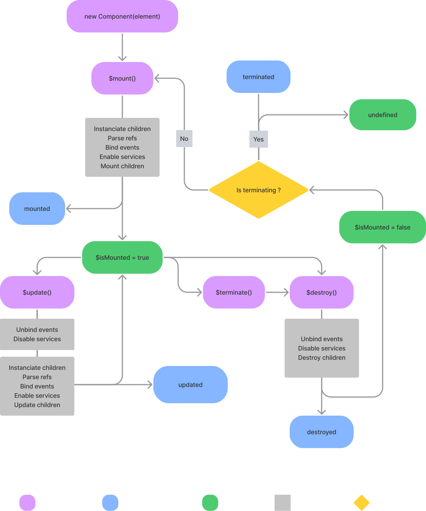

# Lifecycle hooks

## What are lifecyle hooks

Lifecycle hooks are key moments in the life of a component. This framework exposes some basics hooks which can be extended with decorators.

| Hook         | Timing                                                                                                                            |
| ------------ | --------------------------------------------------------------------------------------------------------------------------------- |
| `mounted`    | Executed when the component is mounted by a parent or via the [instance `$mount` method](/api/instance-methods.html#mount).       |
| `destroyed`  | Executed when the component is destroyed by a parent or via the [instance `$destroy` method](/api/instance-methods.html#destroy). |
| `updated`    | Executed when the component is updated by a parent or via the [instance `$update` method](/api/instance-methods.html#update).     |
| `terminated` | Executed when the [instance `$terminate` method](/api/instance-methods.html#update) is called.                                    |

The [lifecycle hooks diagram](#lifecycle-hooks-diagram) below present in greater detail how theses hooks works with one another.

## Using lifecycle hooks

To use a lifecycle hook, declare it as a method of your class, the method will be executed by the internals of the framework at the right time.

```js
import { Base } from '@studiometa/js-toolkit';

export default class Component extends Base {
  static config = {
    name: 'Component',
    log: true,
  };

  mounted() {
    this.$log('mounted');
  }

  updated() {
    this.$log('updated');
  }

  destroyed() {
    this.$log('destroyed');
  }

  terminated() {
    this.$log('terminated');
  }
}
```

:::tip
Find details for the lifecycle hooks APIs in the [Lifecycle hooks](/api/methods-hooks-lifecycle.html) section in the API Reference.
:::

When extending an existing component, do not forget to call the parent component hook methods via the `super` keyword:

```js {8-10}
import Parent from './Parent.js';

export default class Child extends Parent {
  static config = {
    name: 'Child',
  };

  mounted() {
    super.mounted(); // call the parent method
  }
}
```

## Lifecycle hooks diagram

<div class="my-12 block-full-width">
  
  
</div>

<!-- FigJam file: https://www.figma.com/file/afha9583dXdRnbZZ9OSww2/Untitled?node-id=0%3A1 -->
