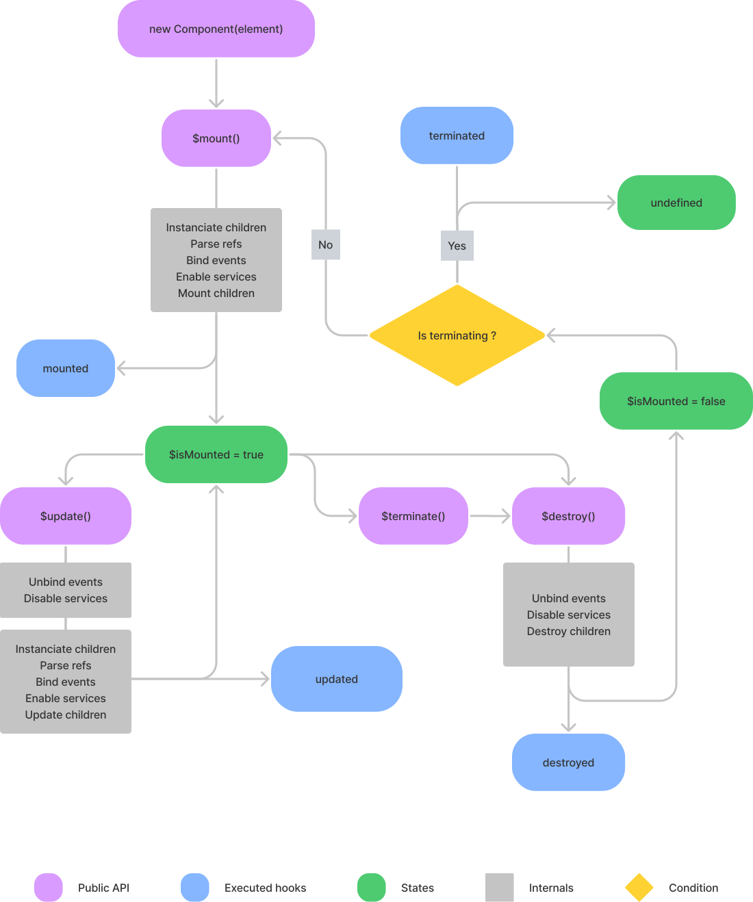
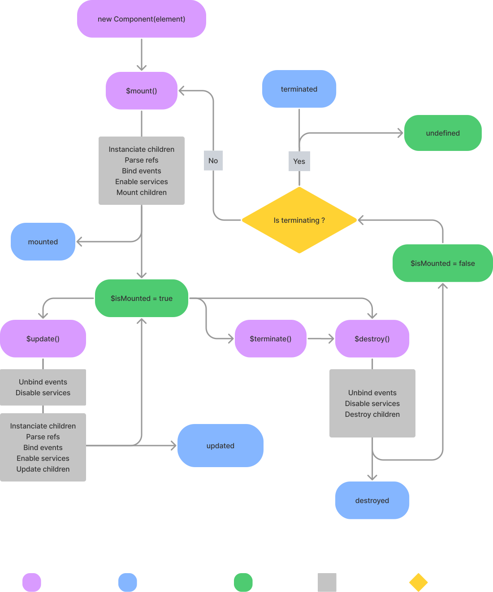

# Lifecycle

Each component goes through a series of steps — being created, mounted into the DOM, updated, and destroyed. Lifecycle hooks let you run code at each of these stages.

| Hook         | Timing                                                                                                                   |
| ------------ | ------------------------------------------------------------------------------------------------------------------------ |
| `mounted`    | Runs when a parent mounts the component or calls the [instance `$mount` method](/api/instance-methods.html#mount).       |
| `destroyed`  | Runs when a parent destroys the component or calls the [instance `$destroy` method](/api/instance-methods.html#destroy). |
| `updated`    | Runs when a parent updates the component or calls the [instance `$update` method](/api/instance-methods.html#update).    |
| `terminated` | Runs when code calls the [instance `$terminate` method](/api/instance-methods.html#terminate).                           |

The [lifecycle hooks diagram](#lifecycle-hooks-diagram) below presents in greater detail how these hooks work together.

## Using lifecycle hooks

To use a lifecycle hook, declare it as a method of your class. js-toolkit calls it automatically at the right time.

```js
import { Base } from '@studiometa/js-toolkit';

export default class Component extends Base {
  static config = {
    name: 'Component',
    log: true,
  };

  mounted() {
    this.$log('mounted');
  }

  updated() {
    this.$log('updated');
  }

  destroyed() {
    this.$log('destroyed');
  }

  terminated() {
    this.$log('terminated');
  }
}
```

When extending an existing component, do not forget to call the parent component hook methods via the `super` keyword:

```js {8-10}
import Parent from './Parent.js';

export default class Child extends Parent {
  static config = {
    name: 'Child',
  };

  mounted() {
    super.mounted(); // call the parent method
  }
}
```

## Lifecycle hooks diagram

<div class="my-12 block-full-width">
  
  
</div>

<!-- FigJam file: https://www.figma.com/file/afha9583dXdRnbZZ9OSww2/Untitled?node-id=0%3A1 -->

---

See also: [Lifecycle hooks](/api/methods-hooks-lifecycle.html)
