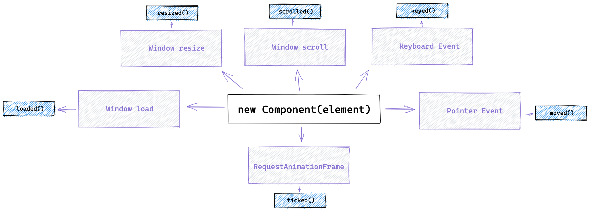

# Using services

## What are services?

When developping components for a web page, we often need to implement trivial task in multiple places such a reacting to the resize of the window, reacting to the user scroll. Services were created to standardize and simplify how we implement such behaviours.

The following services are exported by the `@studiometa/js-toolkit` package:

- [`useDrag`](/api/services/useDrag.html) to implement drag behaviour with inertia
- [`useScroll`](/api/services/useScroll.html) to implement behaviour on scroll (throttled)
- [`useResize`](/api/services/useResize.html) to implement behaviour on window resize (debounced)
- [`useRaf`](/api/services/useRaf.html) to implement loop behaviour with `requestAnimationFrame`
- [`usePointer`](/api/services/usePointer.html) to implement behaviour reacting to the user pointer (mouse or touch)
- [`useKey`](/api/services/useKey.html) to implement behaviour reacting on keyboard interaction
- [`useLoad`](/api/services/useLoad.html) to implement behaviour on page load

:::tip
Find all natively available services and their API details in the [Services](/api/services/) section from the API Reference.
:::

## Usage

### As class methods

Services can be used via predefined class methods (called [services hooks](/api/methods-hooks-services.html)) when extending the `Base` class. They will be automatically enabled when the component is mounted if the method is defined or if a listener has been added to its corresponding event.

The following service hooks and events are available:

- `scrolled` for the `useScroll` service
- `resized` for the `useResize` service
- `ticked` for the `useRaf` service
- `moved` for the `usePointer` service
- `keyed` for the `useKey` service
- `loaded` for the `useLoad` service

**Service methods diagram**

The following diagram can be helpful to understand what action will trigger a service method:

<div class="my-10 block-full-width">
  
</div>

**Using a service via its reserved method name**

```js{8-12}
import { Base } from '@studiometa/js-toolkit';

class Component extends Base {
  static config = {
    name: 'Component',
  };

  scrolled(props) {
    if (props.changed.y) {
      console.log('User is scrolling vertically.');
    }
  }
}
```

**Using a service via its corresponding event**

```js{9-13}
import { Base } from '@studiometa/js-toolkit';

class Component extends Base {
  static config = {
    name: 'Component',
  };

  mounted() {
    this.$on('scrolled', (props) => {
      if (props.changed.y) {
        console.log('User is scrolling vertically.');
      }
    });
  }
}
```

:::tip Best practice
Services **should always be used via the method API**. The event API has been designed for library author.
:::

### Standalone

Services can be used outside of a `Base` class by importing the `use<Service>` functions from the package. Each `use<Service>` function will return an object containing the following:

- an `add(key, callback)` function to add a new callback to the service
- an `has(key)` function to test if the given key matches an added callback
- a `remove(key)` function to remove a callback by its key
- a `props()` function returning the properties of the service

For example, to do something when the user scrolls, you can use the "scrolled" service and its `useScroll()` function:

```js
import { useScroll } from '@studiometa/js-toolkit';

const scroll = useScroll();
const key = 'some-uniq-key';

// Add a callback for the service
scroll.add(key, (props) => {
  // The `props` parameter is the same object
  // returned by the `service.props()` method
  console.log(props.y === scroll.props().y);

  if (props.changed.y) {
    console.log('User is scrolling vertically.');
  }
});

// Test if the callback already exists or not
console.log(scroll.has(key)); // true

// Remove the callback
scroll.remove(key);
```

The service properties can also be destructured for simplicity:

```js
const { add, remove, props, has } = useScroll();
```

## Enabling/disabling a service

By default, if a service is used either via a class method or via an event, it will be enabled when the instance is mounted and will not be disabled until the instance is destroyed. This can sometimes be counterproductive for many reasons: performances, one-time behaviours, etc.

Services in a `Base` instance are managed by a `ServicesManager` available with the [`$services` property](/api/instance-properties.html#services). This manager can help you manage which service is running or not.

For example, to toggle the scroll service only when a button has been clicked:

```js{10,13-15}
import { Base } from '@studiometa/js-toolkit';

class Component extends Base {
  static config = {
    name: 'Component',
    refs: ['btn'],
  };

  onBtnClick() {
    this.$services.toggle('scrolled');
  }

  scrolled() {
    console.log('The scrolled service is enabled!');
  }
}
```

:::tip API Reference
Learn more on the service manager in the [API Reference](/api/instance-properties.html#services).
:::
